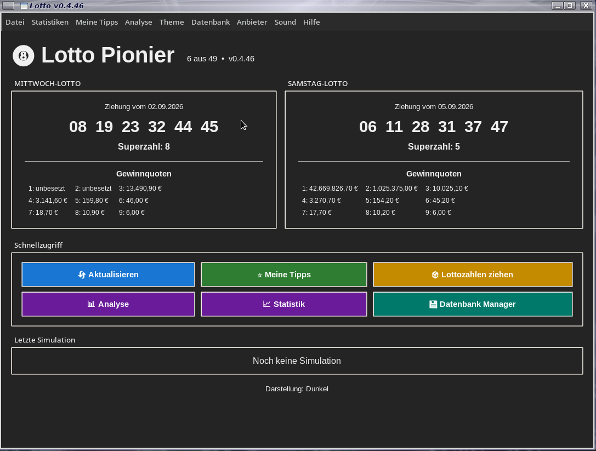
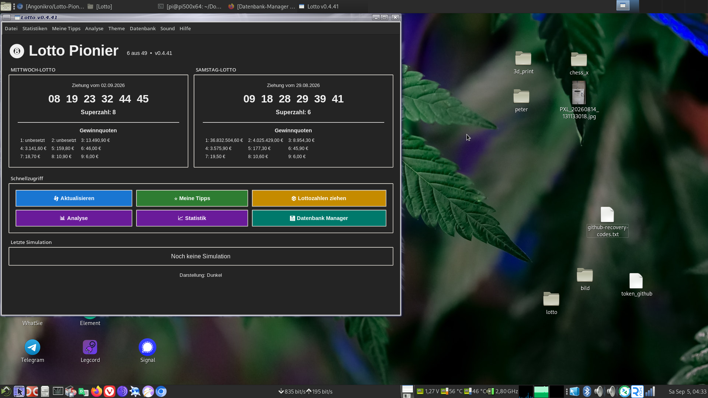

# Lotto Pionier v0.4.45 🍀

Lotto Pionier ist ein Lotto-Programm mit Statistik, Tippfunktionen, Datenbank-Unterstützung und eigener Gewinn-Glocke.





## Funktionen

- 🎱 Lottozahlen anzeigen und aktualisieren
- 📊 Statistik und Analyse
- ⭐ Eigene Tipps
- 💾 Datenbank-Unterstützung
- 🔔 Eigene Gewinn-Glocke
- 🌙 Helles und dunkles Theme

## Installation

### Windows

1. ZIP-Datei entpacken.
2. Python 3 installieren.
3. Im Lotto-Ordner ein Terminal öffnen.
4. Abhängigkeiten installieren:

```bash
pip install -r requirements.txt
```

5. Starten:

```bash
python Lotto.py
```

### Linux

1. ZIP-Datei entpacken.
2. Terminal im Lotto-Ordner öffnen.
3. Falls nötig:

```bash
sudo apt install python3-pip
```

4. Abhängigkeiten installieren:

```bash
python3 -m pip install -r requirements.txt
```

5. Starten:

```bash
python3 Lotto.py
```

## Desktop Launcher (Linux)

Launcher-Rechte setzen:

```bash
chmod +x install_desktop_launcher.sh
```

Launcher installieren:

```bash
./install_desktop_launcher.sh
```

Danach kann Lotto Pionier über das Anwendungsmenü gestartet werden.

## Download

Die aktuelle Version findest du unter den GitHub Releases.

## Version

Lotto Pionier v0.4.44
